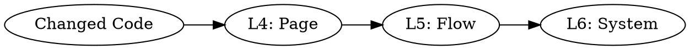

# Integration Review

## Overview

Code review validates code quality. Integration review validates the code **works in the product**.

**Core principle:** Start at the change, expand outward until you reach the edges of the system. Every layer must prove itself with evidence from a running app.

## When to Use

- After CR passes, before SH (ship)
- After implementing any UI feature
- After wiring frontend to backend
- After adding navigation, links, or cross-page references
- When multiple stories in the same area complete in sequence

**NOT for:** Pure backend logic with no UI surface, documentation, config changes.

## The Expansion Model



CR already covers Levels 1-3 (code, function, component). This skill covers **4-6**.

## Pre-Conditions

1. App must be running (frontend + backend + DB)
2. Playwright MCP or browser must be available
3. Git diff available to identify changed files
4. Test credentials available for authenticated routes

If the app isn't running, start it first. Do not skip to "it should work."

## Level 4: Page Verification

**Question:** Does the page containing the change actually work with real data?

```
1. IDENTIFY which page(s) contain the changed code
   - Map: changed component → parent page → route
2. NAVIGATE to that page in the running app
3. VERIFY:
   - Page renders without console errors
   - Data loads (no infinite spinners, no empty states when data exists)
   - Changed component is visible and displays real data
   - Interactive elements respond (click, hover, type)
4. EVIDENCE: Screenshot or DOM snapshot proving page works
```

**Failure modes to catch:**
- Component renders but API returns 401/403/500
- Hook fires but endpoint path doesn't match backend route
- Data shape from API doesn't match TypeScript interface
- Loading state never resolves

## Level 5: Flow Verification

**Question:** Do the paths TO and FROM this page work?

```
1. TRACE INBOUND: What links/navigates TO this page?
   - Sidebar link? Breadcrumb? Button on another page? Card click?
   - Navigate via each inbound path — does it arrive correctly?
2. TRACE OUTBOUND: What does this page link/navigate TO?
   - Buttons, links, drawer opens, tab switches, form submissions
   - Click each — does the destination work?
3. VERIFY ROUND-TRIP:
   - Can you navigate away and back without losing state?
   - Do filters/selections persist across navigation?
4. EVIDENCE: Describe the paths tested and results
```

**Failure modes to catch:**
- Sidebar link exists but route not registered in router
- "View Details" button has no onClick handler
- Navigation works but destination shows wrong data (missing context/params)
- Back button breaks state

## Level 6: System Verification

**Question:** Does the feature make sense in the context of the whole product?

```
1. CROSS-DOMAIN: Does this feature reference or depend on other domains?
   - Registry tool → Pipeline card → Evaluation → Overlap (data chain)
   - Verify the chain end-to-end
2. CONSISTENCY: Does this feature match patterns elsewhere?
   - Same type of data displayed differently in two places?
   - Same action available in one view but not another?
3. DEAD-END CHECK: Are there any orphaned elements?
   - Buttons that render but do nothing
   - Tabs that show but have no content
   - Badge counts that never update
4. ROLE CHECK: Does the feature respect RBAC?
   - Visible to correct roles? Hidden from others?
5. EVIDENCE: List any system-level gaps found
```

**Failure modes to catch:**
- Feature works in isolation but conflicts with another feature
- Data shows in registry but not in pipeline (or vice versa)
- Admin-only endpoint exposed to viewer role in UI
- Duplicate functionality across domains nobody noticed

## Execution Protocol

```
STEP 1: Scope
  - Run git diff --name-only to identify changed files
  - Map files to domains and pages
  - Determine which levels apply (pure backend = skip L4-L5)

STEP 2: Launch
  - Verify app is running (curl health endpoint or navigate to /)
  - Log in with test credentials
  - Note: if app won't start, that IS the finding — stop and report

STEP 3: Expand (L4 → L5 → L6)
  - Execute each level in order
  - At each level: if BLOCKED (page won't load, can't navigate), STOP
  - A failure at L4 means L5 and L6 are not reachable — fix L4 first

STEP 4: Report
  - List findings by level with evidence
  - Categorize: BROKEN (doesn't work), DEAD (renders but no function), GAP (missing connection)
  - Prioritize: BROKEN > DEAD > GAP
```

## What Counts as Evidence

| Claim | Requires |
|-------|----------|
| Page works | Screenshot/snapshot showing real data rendered |
| Button works | Click produced expected result (navigation, modal, API call) |
| Flow works | Successfully navigated the full path with correct data at each step |
| No console errors | Browser console output showing 0 errors |
| API connected | Network tab showing successful response with expected payload |

**NOT evidence:** "It should work", "The code looks correct", "I verified the types match"

## Findings Format

```
## Integration Review Findings

### BROKEN (must fix before ship)
- [L4] Pipeline Overlap tab: API returns 403 for viewer role — endpoint requires ai_analyst
- [L5] Registry → Pipeline navigation: clicking tool name does nothing (missing onClick)

### DEAD (renders but non-functional)
- [L6] Home page "Recent Evaluations" card: always shows empty state, never queries API

### GAP (missing connection)
- [L5] No way to navigate from Pipeline back to Registry for the same tool
- [L6] Overlap data in Pipeline doesn't match Overlap data in Registry drawer (different endpoints)
```

## Common Rationalization

| Excuse | Reality |
|--------|---------|
| "I can see the component renders" | Rendering != working |
| "The types match the API" | Type match != runtime connection |
| "CR already verified this" | CR verified CODE, not PRODUCT |
| "I'll test it manually later" | Later never comes. Test NOW. |
| "The backend isn't running" | Then you can't verify. Start it. |
| "It works in isolation" | Isolation != integration |

## Integration with Lifecycle

```
CS → DS → CR → IR → SH
                ^^
          You are here
```

**CR finds:** Bad code, missing tests, security issues, style violations
**IR finds:** Dead buttons, broken flows, disconnected features, visual-only implementations

## The Bottom Line

**If you can't click through it in a running app, it doesn't work.**

Code that compiles, type-checks, and passes review can still be completely broken in production. This skill ensures features work as a user would experience them — not just as a developer reads them.
